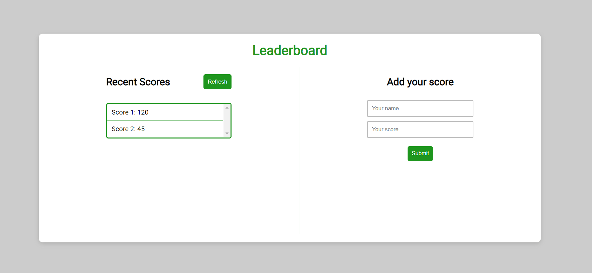

# Leaderboard

> This is a simple implementation of a leaderboard website using a minimalist design.



## Live Demo

[Live Demo Link](https://mirouhml.github.io/leaderboard/)

## Built With

- Webhint
- Stylelint
- ESlint
- Webpack
- ES6

### Prerequisites

The basic requirements for building the executable are:

- A browser application
- A code editor
- Node Package Manager to install the packages necessary for the project
- Basic understanding of the Leaderboard API which you can [check here](https://www.notion.so/microverse/Leaderboard-API-service-24c0c3c116974ac49488d4eb0267ade3)

# Getting Started

#### Cloning the project

```
git clone  https://github.com/mirouhml/leaderboard <Your-Build-Directory>
```

## Getting packages installed
```
npm install
```

## Running the website locally
```
npm run build
npm start
```

## Author

👤 **Mirouhml**

- GitHub: [@mirouhml](https://github.com/mirouhml)
- LinkedIn: [LinkedIn](https://www.linkedin.com/in/ammar-hamlaoui-514909189/)
- Twitter: [@kuronomirou](https://twitter.com/kuronomirou)

## 🤝 Contributing

Contributions, issues, and feature requests are welcome!

Feel free to check the [issues page](../../issues/).

## Show your support

Give a ⭐️ if you like this project!

## 📝 License

This project is [MIT](./MIT.md) licensed.
